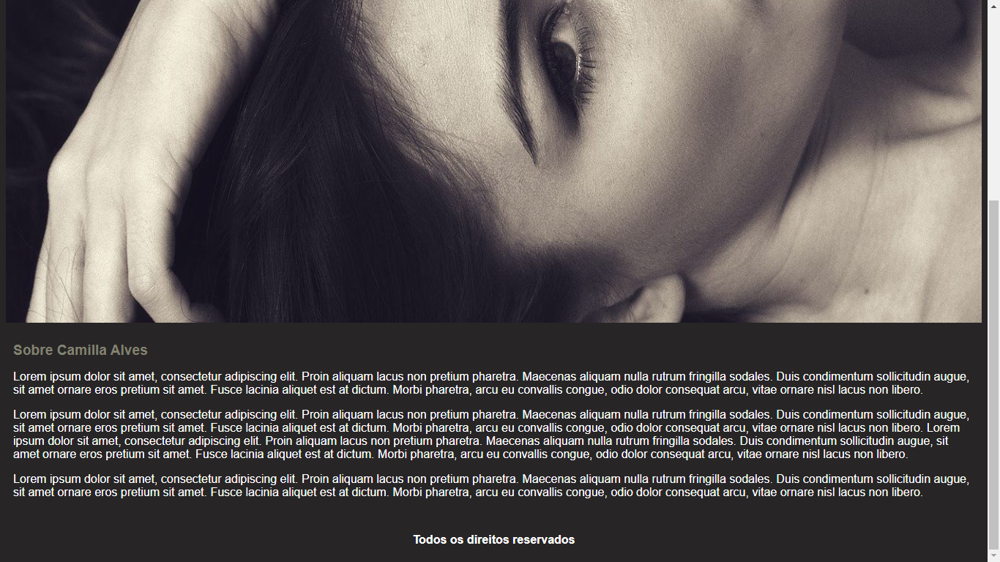
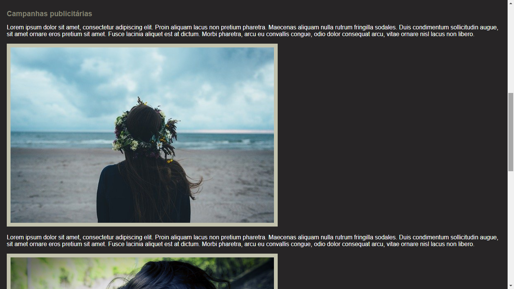
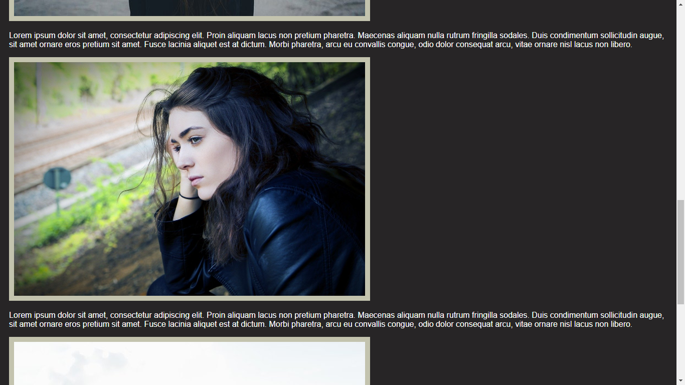
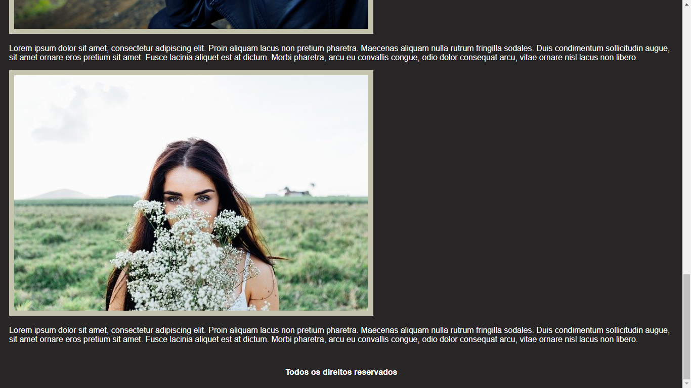

# camillaalves

## Site desenvolvido com o objetivo de colocar em prática os conhecimentos adquiridos em **HTML5 e CSS3** até aqui.

Através dos repositórios eu farei uma timeline do progresso meu aprendizado, desde o projeto mais básico até o mais avançado.

Este aqui, sendo o primeiro e mais básico, foi desenvolvido apenas com **HTML e CSS**.

 

 

